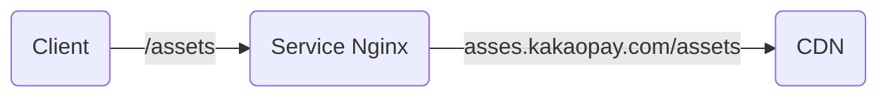

# TL;DR

SSR:

- 첫페이지를 보여주는 속도가 빠르다.
- 기존 페이지를 마이그레이션 할 때는 url 별로 진행, 실패시 기존 url 로 전환
- Universal Rendering 이 답인가?

# References

Naver D2 블로그 사이트 전환기

- [어서 와, SSR은 처음이지? - 도입 편](https://d2.naver.com/helloworld/7804182)
  - [The Benefits of Server Side Rendering Over Client Side Rendering ](https://medium.com/walmartglobaltech/the-benefits-of-server-side-rendering-over-client-side-rendering-5d07ff2cefe8)
  - [Rendering on the Web](https://web.dev/rendering-on-the-web/)
- [어서 와, SSR은 처음이지? - 개발 편](https://d2.naver.com/helloworld/2177909)

개념을 알기 쉽게 정리

- [SSR(서버사이드 렌더링)과 CSR(클라이언트 사이드 렌더링)](https://miracleground.tistory.com/165)
- [서버 사이드 렌더링이란?](https://joshua1988.github.io/vue-camp/nuxt/ssr.html#%E1%84%8F%E1%85%B3%E1%86%AF%E1%84%85%E1%85%A1%E1%84%8B%E1%85%B5%E1%84%8B%E1%85%A5%E1%86%AB%E1%84%90%E1%85%B3-%E1%84%89%E1%85%A1%E1%84%8B%E1%85%B5%E1%84%83%E1%85%B3-%E1%84%85%E1%85%A6%E1%86%AB%E1%84%83%E1%85%A5%E1%84%85%E1%85%B5%E1%86%BC)

Slash 22 Toss SSR 도입기

- [토스 SLASH22 잃어버린 유저의 시간을 찾아서 영상 내용 정리 (SSR)](https://velog.io/@devfrank9/%ED%86%A0%EC%8A%A4-SLASH22-%EC%9E%83%EC%96%B4%EB%B2%84%EB%A6%B0-%EC%9C%A0%EC%A0%80%EC%9D%98-%EC%8B%9C%EA%B0%84%EC%9D%84-%EC%B0%BE%EC%95%84%EC%84%9C-%EC%98%81%EC%83%81-%EB%82%B4%EC%9A%A9-%EC%A0%95%EB%A6%AC-SSR)

React 18 SSR

- [리액트 18에서 변경될 새로운 SSR 아키텍쳐](https://yceffort.kr/2021/09/react-18-ssr-architecture)

사내 CDN 을 통해 proxy path 를 이용한 방법
- 하나의 dns 를 통해서 접근한다.
- CORS 이슈가 없다.

- nginx 를 이용하여 로컬 캐시를 이용하여 cdn 구축: CORS 회피 방식
	- backend: s3
	- client expire ttl 를 이용하여 client 별로 재빌드는 하지 않음. 
	- server 에서는 cdn 주소를 통해서 nginx 를 호출 (dmz)

- CORS 이슈를 고민해야 한다. 
	- CloudFront
